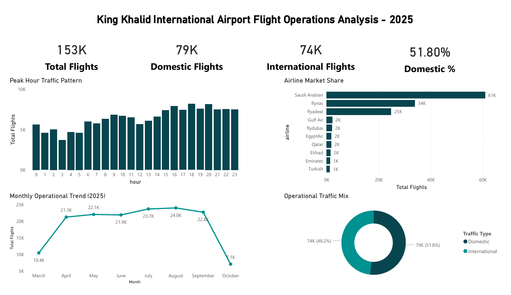

# King Khalid International Airport (RUH)
## Flight Operations Analysis – 2025

## Overview
This project analyzes **153,308 flight records** to examine traffic distribution, operational peaks, airline concentration, and seasonal trends at King Khalid International Airport (RUH).

## Key Metrics
- **Total flights:** 153,308  
- **Departures:** 78,252 (51.0%)  
- **Arrivals:** 75,056 (49.0%)  
- **Domestic flights:** 79,413 (51.8%)  
- **International flights:** 73,895 (48.2%)

## Key Insights
- Peak traffic occurs between **16:00–23:00**, with the highest volume at **18:00**.
- **July and August** represent the busiest months.
- Domestic and international traffic are closely balanced.
- Saudi Arabian Airlines, flynas, and flyadeal dominate overall operations.

## Dataset Source
[King Khalid International Airport Flights Dataset](https://www.kaggle.com/datasets/mohammedalsubaie/king-khalid-international-airport-flights-dataset)

**Author:** Mohammed AlSubaie (Data Engineer)
https://www.kaggle.com/datasets/mohammedalsubaie/king-khalid-international-airport-flights-dataset

## Tools Used
- PySpark (data cleaning and transformation)
- Power BI (dashboard development)
- DAX (measures)

## How to Run
1. Open [Open Notebook](KKIA_Flight_Data_Analysis.ipynb) in Jupyter or Google Colab.
2. Ensure PySpark is installed.
3. Run all cells to reproduce the analysis and export dataset for dashboarding.

## Dashboard Preview

