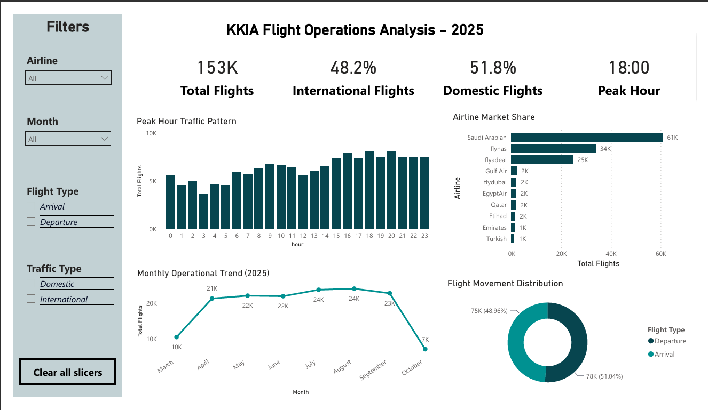

# KKIA Flight Operations Analysis – 2025

## Overview

This project analyzes flight operations at King Khalid International Airport (RUH) to identify traffic patterns across time, airlines, flight movements, and domestic vs. international operations.

The analysis was performed using PySpark for data preparation and exploratory analysis, followed by Power BI and DAX to build an interactive dashboard for exploring key operational metrics.

## Dataset

**Source:** [King Khalid International Airport Flights Dataset](https://www.kaggle.com/datasets/mohammedalsubaie/king-khalid-international-airport-flights-dataset)  
**Platform:** Kaggle  
**Author:** Mohammed AlSubaie

## Business Questions

The project aims to answer the following questions:

- What are the peak operating hours at KKIA?
- Which airlines account for the highest flight volume?
- How does flight activity change across months?
- How is traffic distributed between domestic and international flights?
- How are flight operations distributed between arrivals and departures?

## Data Preparation

The dataset was processed using PySpark to prepare it for analysis and visualization in Power BI.

The data preparation workflow included:

- Parsing scheduled flight timestamps
- Converting timestamps to Riyadh local time
- Extracting date, hour, and month features
- Handling missing airline and destination values
- Classifying flights as domestic or international based on destination airport codes
- Preparing the final analytical dataset for dashboarding
- Exporting the processed dataset to CSV for Power BI

## Exploratory Analysis

Using PySpark, the following areas were analyzed:

- Total flight volume
- Arrivals vs. departures
- Peak operating hours
- Top airlines by flight volume
- Monthly flight traffic
- Domestic vs. international traffic

## Key Metrics

- **Total Flights:** 153K
- **International Flights:** 48.2%
- **Domestic Flights:** 51.8%
- **Peak Hour:** 18:00

## Key Insights

- Flight operations are nearly balanced between arrivals and departures, with departures accounting for approximately 51% of movements and arrivals for 49%.
- Flight activity is highest during the evening, with the peak occurring at 18:00.
- Saudi Arabian Airlines, flynas, and flyadeal account for the largest share of flight operations.
- Flight traffic reaches its highest levels during July and August.
- Domestic flights slightly exceed international flights, representing 51.8% of total flight activity.

## Dashboard

The interactive Power BI dashboard allows users to explore flight operations using filters for:

- Airline
- Month
- Flight Type (Arrival / Departure)
- Traffic Type (Domestic / International)

The dashboard includes:

- Total Flights
- International Flights
- Domestic Flights
- Peak Hour
- Peak Hour Traffic Pattern
- Airline Market Share
- Monthly Operational Trend
- Flight Movement Distribution



## Tools & Technologies

- **PySpark** — Data preparation, transformation, feature engineering, and exploratory analysis
- **Power BI** — Interactive dashboard development and data visualization
- **DAX** — KPI calculations and dynamic measures

## Project Workflow

1. Load the flight dataset using PySpark
2. Clean and transform the data
3. Create time-based and operational features
4. Perform exploratory analysis using Spark DataFrames
5. Prepare the final analytical dataset
6. Export the processed data for Power BI
7. Build DAX measures and KPIs
8. Develop the interactive Power BI dashboard

## Repository Structure

```text
KKIA-Flight-Operations-Analysis-2025/
│
├── Dashboard_Overview.png
├── KKIA_Flight_Data_Analysis.ipynb
├── King Khalid International Airport Flights.pbix
└── README.md
```

## Conclusion

The analysis shows that KKIA flight operations are relatively balanced between arrivals and departures, with a slight dominance of domestic traffic. Flight activity is concentrated during evening hours and reaches its highest levels during the summer months.

The project demonstrates an end-to-end analytics workflow, from processing flight data with PySpark to developing an interactive Power BI dashboard for exploring operational patterns.
